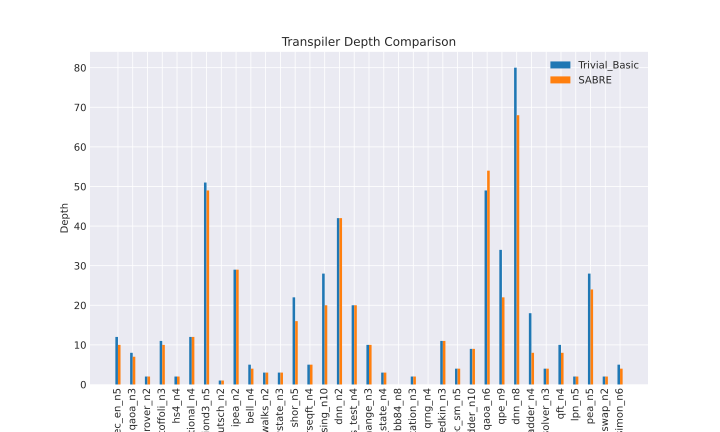

# transpile_benchy

The primary aim of this project is to simplify the process of testing new transpilation passes against a wide range of circuits. In my research studying quantum circuit optimizations, maintaining this repository deocupled from individual projects will make it much easier to evaluate and write reports. Creating a streamlined benchmark suite makes it easy to test the efficiency between multiple transpilation configurations.


---
### Installation

I am using submodules because the dependencies are not all packaged. Therefore, when cloning the repository, you will need to run the following commands to get the submodules:

```bash
git clone https://github.com/evmckinney9/transpile_benchy.git --recurse-submodules
```

### Usage
For a full example, see `src/notebooks/main.ipynb` The project is structured into four main parts. The first three are interfaces for the different components of the benchmarking suite. The fourth is the benchmarking class itself.

### 1. `interface.py`:

This is the interface for quantum circuit sources, i.e., submodules. The base class `SubmoduleInterface` has the abstract method `get_quantum_circuits()`, which should return a list of QuantumCircuits. This class is intended to be subclassed for different sources of QuantumCircuits. Example subclasses provided are `QASMBench` and `RedQueen`. This key functionality allows for finding externally defined projects each with their own set of pre-defined circuits which can be easily added to the benchmark suite here.

#### Example QASMBench

Here, I use the base class `QASMInterface` so all that is left is to define the `get_qasm_files()` function, which is specific to the structure of the submodule.

```python
class QASMBench(QASMInterface):
    """Submodule for QASMBench circuits."""

    def __init__(self, size: str):
        """
        Args:
        size: 'small', 'medium', or 'large'
        """
        self.size = size
        self.qasm_files = self._get_qasm_files("QASMBench", self.size)

    @staticmethod
    def _get_qasm_files(directory: str, size: str) -> List[Path]:
        """Return a list of QASM files."""
        prepath = Path(__file__).resolve().parent.parent.parent
        qasm_files = prepath.glob(f"submodules/{directory}/{size}/**/*.qasm")
        # filter out the transpiled files
        qasm_files = filter(lambda file: "_transpiled" not in str(file), qasm_files)
        # harcode, remove these files that are just way too big
        too_big = ["vqe", "bwt"]
        qasm_files = filter(
            lambda file: not any(x in str(file) for x in too_big), qasm_files
        )
        return list(qasm_files)
```

### 2. `metrics.py`:

This file contains the `MetricInterface` abstract base class, which needs to be subclassed to define metrics. The abstract method `calculate()` should implement the calculation of the metric from a given QuantumCircuit. An example metric `DepthMetric` is provided.

#### Example DepthMetric

We write a function to calculate depth, which finds the critical path of the circuit defined only over 2Q gates.

```python
class DepthMetric(MetricInterface):
    """Calculate the depth of a circuit."""
    def __init__(self):
        self.name = "Depth"

    def calculate(self, circuit: QuantumCircuit) -> float:
        """Calculate the depth of a circuit."""
        exclude_gates = [
            "measure", "barrier", "u3", "u", "ry", "rz", "rx", "x", "y", "z", "h", "s", "t",
        ]
        return circuit.depth(filter_function=lambda x: x[0].name not in exclude_gates)

```

### 3. `runner.py`:

This file includes `AbstractRunner`, an abstract base class that outlines the structure of a custom transpiler. It defines the `pre_process()`, `main_process()`, and `post_process()` methods which are meant to be implemented in subclasses for different types of transpilers. The `run()` method is also defined here which runs the three processing methods and returns the resulting circuit. An example class `CustomPassManager` is provided which is a custom transpiler that outlines the structure of the main processing method.

#### Example Trivial_Basic

Use the base class `CustomPassManager`, and assign which Qiskit layout and routing passes we want to use.

```python
class Trivial_Basic(CustomPassManager):
    def main_process(self):
        """Process the circuit."""
        self.pm.append(
            [
                TrivialLayout(self.coupling),
                FullAncillaAllocation(self.coupling),
                EnlargeWithAncilla(),
                ApplyLayout(),
                BasicSwap(self.coupling),
            ]
        )
```

### 4. `benchmark.py`:

This is the core benchmarking class `Benchmark`. It loads circuits from the submodules, applies the transpilers to them, calculates metrics on the transpiled circuits, and plots the results. The plots compare the metrics of the different transpilers on each circuit.



### Selected Benchmark Suite

The main benchmark suite that we will use for this project is [QASMBench](https://github.com/pnnl/QASMBench). It provides a long list of qasm files which serve as an excellent resource for running various transpilation configurations. Other submodules will be included as well, provided they contain qasm files not already included in QASMBench.

### Other Existing Benchmark Suites

This project is intended for our own research purposes and is not meant to be exhaustive. However, here are some other existing benchmark suites that are available in the field:

- [RedQueen](https://github.com/Qiskit/red-queen/tree/main)
- [MQTBench](https://github.com/cda-tum/MQTBench)
- [Arline Benchmarks](https://github.com/ArlineQ/arline_benchmarks)
- [QC-App-Oriented-Benchmarks](https://github.com/SRI-International/QC-App-Oriented-Benchmarks)
- [QUEKO-benchmark](https://github.com/tbcdebug/QUEKO-benchmark)
- [Supermarq](https://github.com/SupertechLabs/client-superstaq)

### Further Reading

- https://nonhermitian.org/posts/2021/2021-10-31-best_swap_mapper_qiskit.html
